# EE538 Final Project - Spring 2022 - TrojanMap
# Report

Name: Hansen Li  
USC ID: 6356792829  
Email: hansenli@usc.edu


## Overview

<p align="center"></p>

<p align="center">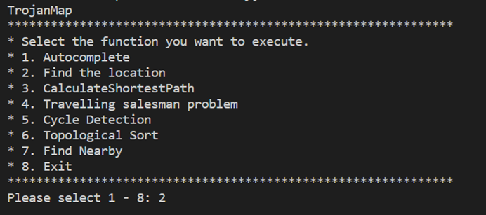</p>

## Data Structure
Graph 

<p align="center">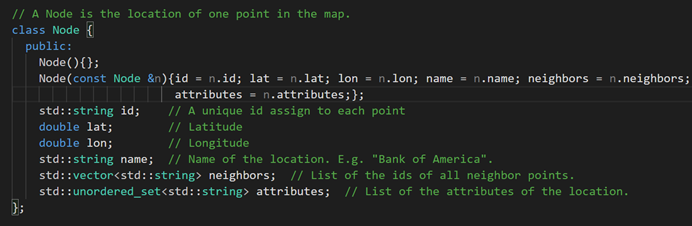</p>


## 1. Autocomplete

Input: prefix of name   
Output: possible name

The function will traverse all the points in the data file and then convert them to the same lowercase form, return all the possible name based on the input prefix. 

<p align="center">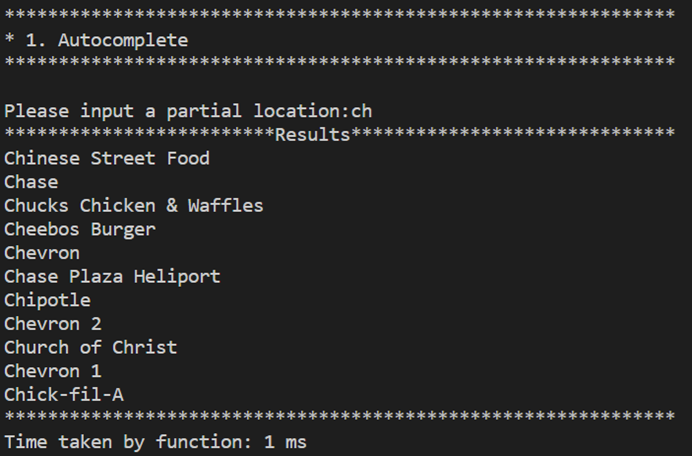</p>

```Time complexity: O(n)```


## 2. Find the location

When a user inputs a place name, the function will find the location and give the longitude and latitude of the location as well as display the point in the map window. 

<p align="center"></p>  

If the location name does not exist, the will give a clostest name based on the user input.  
  
Result using recursion without DP :
<p align="center">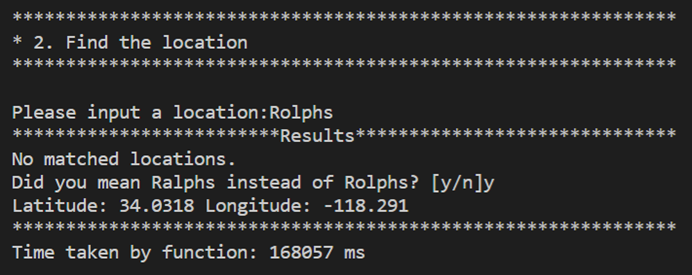</p>

Result using Dynamic Programming:  

<p align="center">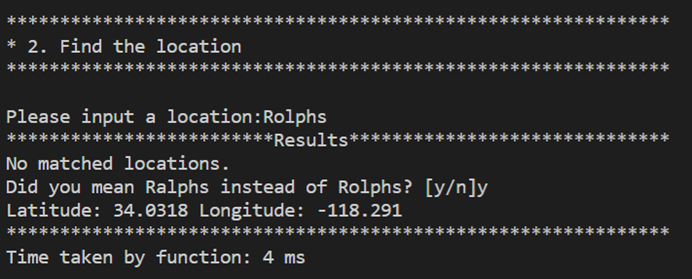</p>


Calcucating Edit Distance: 
```c++
deletion: dp[i][j]=dp[i−1][j]+cost(del)
insertion: dp[i][j]=dp[i][j−1]+cost(insert)
substitution: dp[i][j]=dp[i−1][j−1]+cost(sub)
```
<p align="center">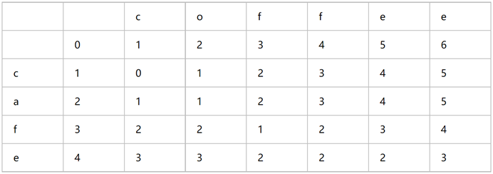</p>

```Time complexity is O(n^2)```


## 3. Calculate shortest path

I tried two algorithms: Dijkstra and Bellman-ford.

### Dijkstra:

```c++
std::vector<std::string> TrojanMap::CalculateShortestPath_Dijkstra(
    std::string location1_name, std::string location2_name)
```
#### Algorithm:
1. Get the start and end node from points’ names.    
2. Create a min heap using priority queue with pair of <dist,id>.  
3. Use a unordered map to save the shortest distance of each node.  
4. Use a unordered map to save the predecessor of each node to build the path later.  
5. Use a unordered map to store the visited nodes;  
6. Initialize the map with start node is visited, the distance is 0 and 
put the start node into the min heap.  
7. Extract the node from min heap and update the map until we find the destination node or the heap is empty.  
8. Use predecessor map to build the entire shortest path.  


### Bellman-Ford:
```c++
std::vector<std::string> TrojanMap::CalculateShortestPath_Bellman_Ford(
    std::string location1_name, std::string location2_name)
```
#### Algorithm:
1. Get the start and end node from points’ names;  
2. Use a unordered map to save the shortest distance of each node.  
3. Use a unordered map to save the predecessor of each node to build the path later;  
4. Set a boolean stop sign as true;  
5. Traverse all edges  

```Time complexity: O(E * V), E is the number of edges, V is the number of nodes.```


### Result  

Start: KFC  
Destination: Arco

<p align="center">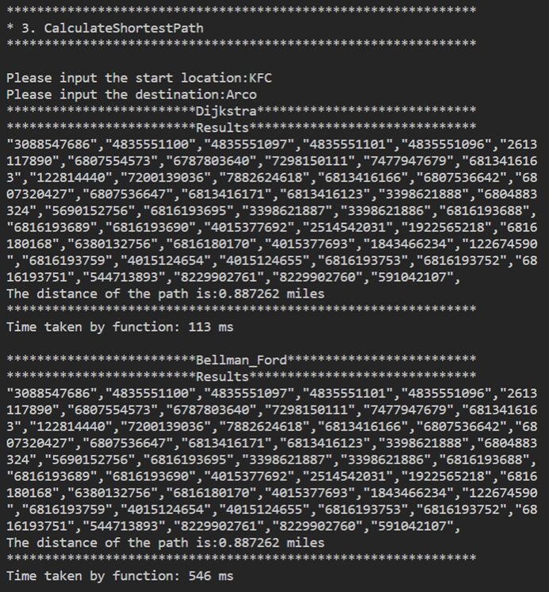</p>
<p align="center">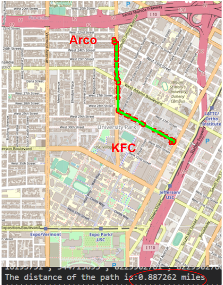</p>

#### Compare with Google map:

<p align="center">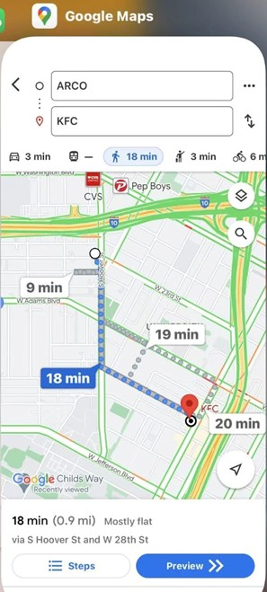</p>

## Dijkstra vs Bellman-Ford 

#### time cost: 
<p align="center">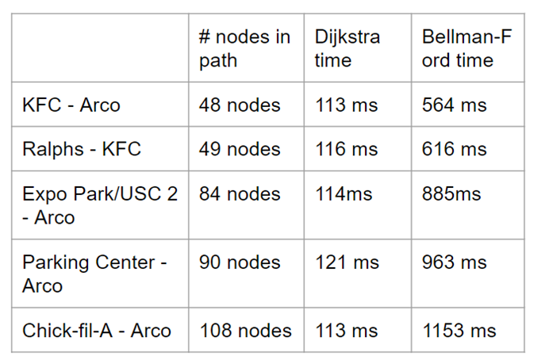</p>

```time complexity of Dijkstra: O((m+n)log(n))```

```time complexity of Bellman-Ford: O(m*n)```


## 4. The Traveling Trojan Problem

In this function, when user enter the number of places, it will select N random points and calculate the best path to travel all the points with the minimum cost. 

I tried three algorithm in this problem: Brute Force, Backtracking and 2 opt. 


### Brute Force:

This algorithm traverses all possible permutations.   


```c++
std::pair<double, std::vector<std::vector<std::string>>> TravellingTrojan_Brute_force(
                                    std::vector<std::string> location_ids)
```
### Result:
the number of places: 8
<p align="center">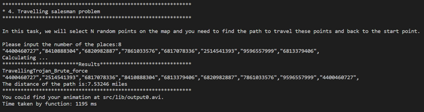</p>

```Time complexity is O(n!)```


### Backtracking:

This algorithm traverses all possible permutations with conditions, so by using the early backtracking, the time complexity is much lower then brute force.  


```c++
std::pair<double, std::vector<std::vector<std::string>>> TravellingTrojan_Backtracking(
                                    std::vector<std::string> location_ids)
```
### Result:
the number of places: 8
<p align="center">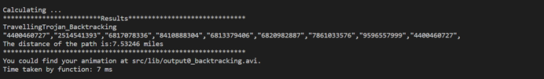</p>

```Time complexity is O(n!)```


### 2-opt:

#### Algorithm:  
1. Same as using Brute Force except that we don’t use permutations  
2. Instead of using permutations, we use two for loops to obtain a sub part in location ids vector and reverse this sub part.  
3. If the updated vector’s path length is smaller, we update things like what we did in Brute Force and go back to start again.  
4. Repeat until no improvement is made.  


```c++
std::pair<double, std::vector<std::vector<std::string>>> TravellingTrojan_2opt(
                              std::vector<std::string> &location_ids)
```

### Result  

The number of places is 8:
<p align="center"></p>


```Time complexity is O(n^2)```

### Compare: Brute Force vs Backtracking vs 2-opt  

<p align="center"></p>

Brute Force path:  
<video id="video" controls="" preload="none">
      <source id="avi" src="src/lib/output0.avi" type="video/avi">
</video>  

Backtracking:

<video id="video" controls="" preload="none">
      <source id="avi" src="src/lib/output0_backtracking.avi" type="video/avi">
</video>  


2-opt:  

<video id="video" controls="" preload="none">
      <source id="avi" src="src/lib/output0_2opt.avi" type="video/avi">
</video>   


## 5. Cycle Detection

#### Algorithm:
1. Create a map visited, and another map predecessor.
2. Traverse all nodes on the map
3. If the node’ position is in the square, add pair of <id, false> in map visited
4. Traverse all nodes in the visited map
5. If the node has not been visited, go to the hasCycle function
6. If hasCycle function returns true, use predecessor map to plot a cycle and return true


```c++
bool TrojanMap::CycleDetection(std::vector<double> &square)
```
  
#### Result：
cycle exists:
<p align="center">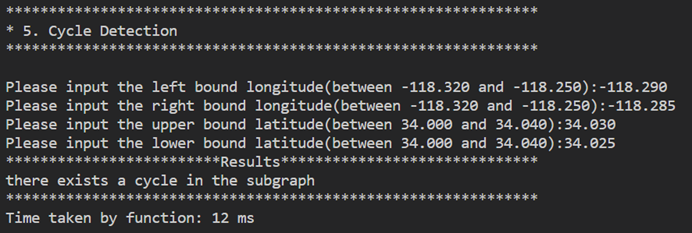</p>
<p align="center">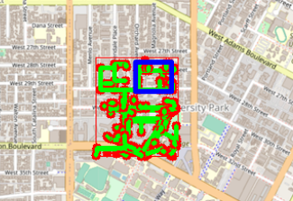</p>

no cycle:
<p align="center">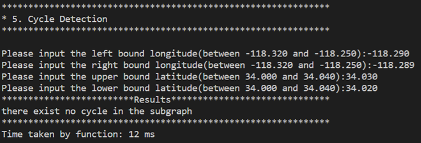</p>
<p align="center">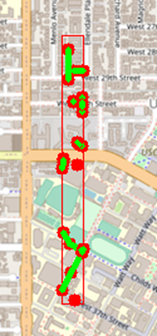</p>


```Time complexity: O(n^2)```


## 6. Topological Sort                                         


In this function. We input a vector of location. Their topological order is obtained based on the given set of dependencies. Firstly, DFS starts with the starting point, and when all neighbours of the node have been accessed, it will be added to a list. Then the nodes that have never been accessed start DFS again for avid duplicats. Finally, the vector is reversed to give a  topological sequence.

```c++  
bool TrojanMap::CycleDetection(std::vector<double> &square)
```

#### Result:
The result contains 10 places:

<p align="center">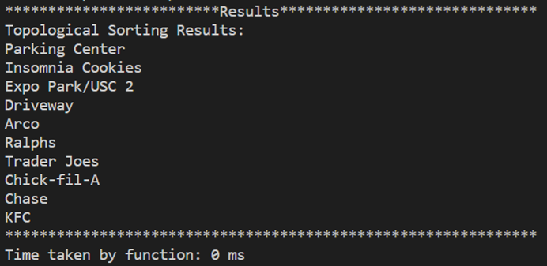</p>

The topological sort result display on map:
<p align="center">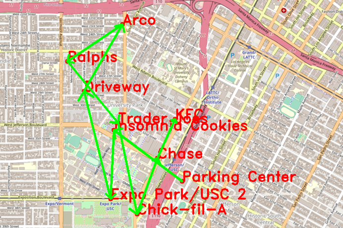</p>


`Time complexity: O(n^2)`

## 7. Find Nearby
#### Algorithm:

In this function, it firstly calculates the distance of all positions based on the input position, then sort the result and return k possible results. 

```c++
std::vector<std::string> FindNearby(std::string attributesName, std::string name, double r, int k);
```


#### Result:

<p align="center">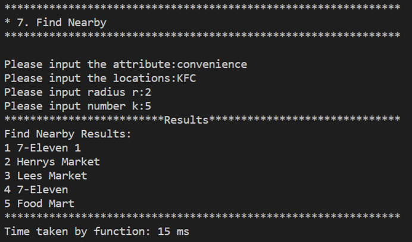</p>
map result:  
<p align="center">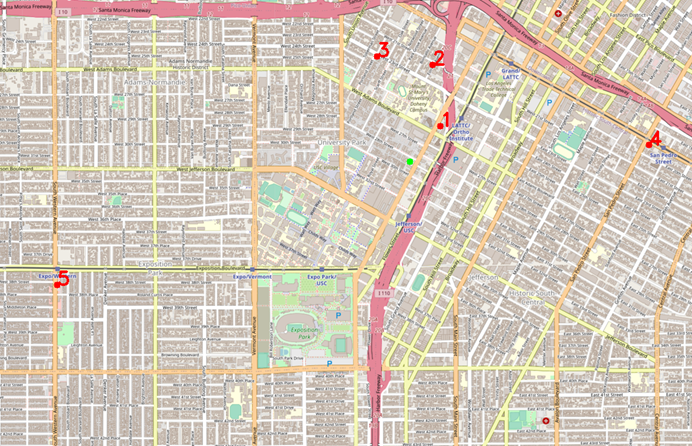</p>


```Time complexity: O(n*log(n))```


## Reflection:
* Learned a lot in this course and the final project. 

* Different algorithms, and data structures, how to implement in C++.

* DFS is really useful. 

* DP is powerful to optimize the time complexity. 

* More confidence when solving a problem. 

